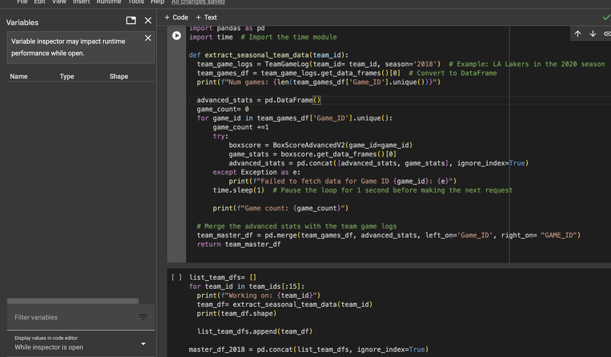
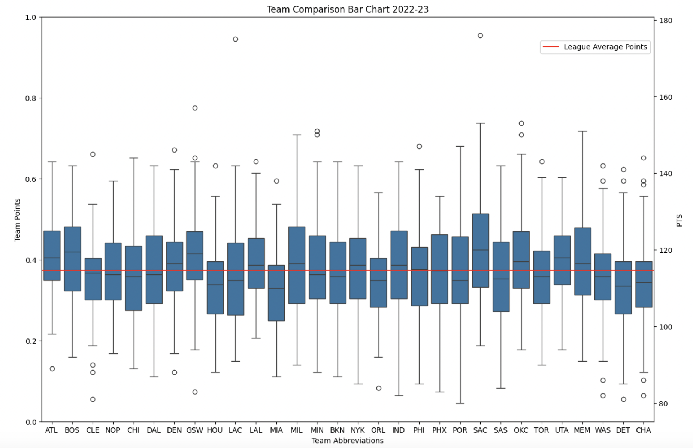

# Rubric for Project Checkpoint 2

## Title

NBA Team Rooster Optimization

## Team

Point of Contact: aadit2697   Member1: aadit2697   Member2: revanthshahukaru   Member3: mnmcfadd   Member4: VrushaliLad799   Member5: Kapil1917T

## Overview

Our NBA project revolves around using historical game data to develop two predictive models with practical applications for teams and players - Model 1 aims to predict whether a team will win or lose a game based on various player-level features, including player performance statistics and game outcomes. Model 2 aims to predict whether a player will be benched or play in a game, leveraging the predictions from Model 1 along with other relevant player features.

Basis our research, we have identified an approach wherein we combine player-level statistics, team-level statistics, gameovergame data, leaguedashboard data to provide valuable insights into player usage and team success. By incorporating predicted game outcomes from the first model into the second model, we hope to capture how player performance impacts team decisions in real-time.

The significance of our work lies in its potential to assist coaches, team managers, and analysts in making informed decisions. By accurately forecasting game results and player benching, our models can guide lineup choices, player rotations, and in-game strategies. Ultimately, our project aims to empower NBA teams with actionable insights that enhance performance and decision-making.

In addition, we have the following to-do list:
- We might need to get rid of team, player and game ID since those large numbers can affect modelling. Might use them temporarily to extract features if needed, but to be dropped premodelling.
- Use game date to create season as factor/category and drop game date- done
- Get rid of match-ups, we will use game_ids for game level predictions
- Look at cols with name estimates and check for multi collinearity and then drop whats not needed.
- Adding a feature that takes into account the rest days in the past between 2 consecutive games
- Add a feature whether the game was a home/away game- done
- Post standard scaling, we will use random forest for our base model. Given the number of numeric columns, random forest would be a good base model to start from.

## Data

This is one of the most important parts of this submission. You will include a link to the source of your data, and explain the work you have done to validate that this is a credible dataset. 
We used multiple nba-api endpoints to fetch the required data to meet the project requirements.

  

Link to the data source: https://drive.google.com/file/d/1-CURFMnFUuEeQJ_uDcKcuuZl9BHJNttZ/view?usp=share_link
Please access the data using a .syr google account.

   
As seen in the box plot above, DEN's average points is above the league's average with regards to average points scored in the 2022-23 season. MIA's average points scored in that season is well below the league's average but they were still able to make an appearance in the championship series. However, we can see how DEN is a more offensively dominant team compared to MIA, suggesting that DEN is a high-scoring team while MIA is a low scoring team. There are two assumptions that can be made from the above observation.

DEN is a high-scoring team and in order to win, they would require outscoring their opponents or showcase defensive dominance. Since the team is focusing on the offensive influence of a team's success, we will be understanding DEN's field goal percentage to confirm if they are affected by their opponents defensive capabilities. If their field goal percentage is above 50%, it would confirm their offensive domination and the fact that their opponents' defensive capabilities do not affect the team's scoring abilities significantly.
MIA is a low-scoring team and in order to win games, they would need to showcase defensive prowess in order to contain their opponents score to one that is lower than theirs.
From these assumptions, we can subset game log for DEN and MIA, and focus on their statistics against their opponents. For our next EDA, the team decided to understand what DEN's field goal percentage was with respect to their opponents in the same season.

Field Goal Percentage represents the precentage of field goals made out of the total number of field goals attempted.

## Preprocessing

If your data required some preprocessing (surely it did!) document your techniques here.  If this resulted in interesting transformations, you can include examples in code and visualizations to help me understand how the data was transformed.  If you did any sophisticated imputations (e.g. a custom imputation method) feel free to include a code snippet to show me how this was done.

Once we readied the master data, we proceeded with creating dummies. In the initial stage of the project, we expect more features to be helpful in predicting our outcome variable(win_loss). Keeping in mind the large number of columns we have begun to use the random forest classifier.  
As we started off, we havent scaled the features since scaling is not required for the features to be fit into a random forest classifier. This will also help in selecting features by using the feature importance plot for random forest.

## Modeling

We have begun modelling using random forest first, due to the reaasons of feature selection as mentioned above. While we are still in the process of using random forest to select the best features for the model, we do not have a submissible f-statistic/accuracy as of yet.

## Problems & Challenges

- One problem we faced was understanding the metadata of the data. 
- Handling frequent timeout errors during data aquisition.
- Cleaning has been a cycle, since during model creation, we keep coming accross columns that woould not be of the right datatype due to characters in string.

## Next steps

Tell me where you are going with the project; what are the next steps, and when do you think they will be done?  Include rough dates!
- We might need to get rid of team, player and game ID since those large numbers can affect modelling. Might use them temporarily to extract features if needed, but to be dropped premodelling.
- Use game date to create season as factor/category and drop game date- done
- Get rid of match-ups, we will use game_ids for game level predictions
- Look at cols with name estimates and check for multi collinearity(cols with team and player estimates) and then drop whats not needed.
- Adding a feature that takes into account the rest days in the past between 2 consecutive games
- Add a feature whether the game was a home/away game- done
- Post standard scaling, we will use random forest for our base model. Given the number of numeric columns, random forest would be a good base model to start from.
