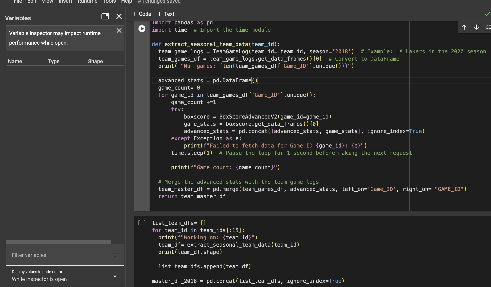
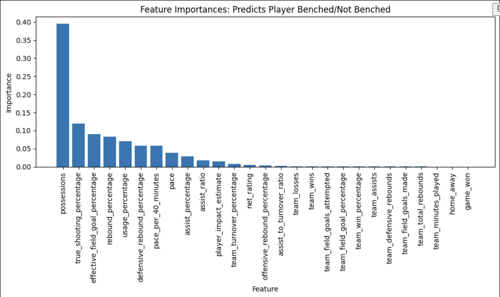

# Rubric for Final Project

Your final report will follow the format of a standard scientific report, and will be written in **markdown** format, but submitted along with supporting jupyter notebooks.  Please do **not** submit data directly, but instead provide links where the data can be retrieved, or (if the data cannot be readily shared) where the data is described.  

**All submission files will be saved in the same directory as this rubric**. The report will be named "report.md."  Only the point of contact needs to submit a final project, and the point of contact will be responsible for sharing feedback with the group.

Failure to follow the above instructions will result in an automatic 2 point deduction without exception. Your report will have the following sections.

### Title

NBA Team Rooster Optimization

### Team

Point of Contact: aadit2697 
Member1: aadit2697 
Member2: revanthshahukaru 
Member3: mnmcfadd 
Member4: VrushaliLad799 
Member5: Kapil1917T 
### Introduction

Our NBA project revolves around using historical game data to develop two predictive models with practical applications for teams and players - Model 1 aims to predict whether a team will win or lose a game based on various player-level features, including player performance statistics and game outcomes. Model 2 aims to predict whether a player will be benched or play in a game, leveraging the predictions from Model 1 along with other relevant player features.

Basis our research, we have identified an approach wherein we combine player-level statistics, team-level statistics, gameovergame data, leaguedashboard data to provide valuable insights into player usage and team success. By incorporating predicted game outcomes from the first model(won/lost) into the second model, we hope to capture how player performance impacts team decisions in real-time.

The significance of our work lies in its potential to assist coaches, team managers, and analysts in making informed decisions to build effective roster combinations for games in the season. By accurately forecasting game results and player benching, our models can guide lineup choices, player rotations, and in-game strategies. This aim of this project is to create knowledge from the information collected at player/team/game level to help NBA teams with actionable insights that help them avoid repeating prior mistakes and enhance the decision-making process.

### Literature Review

This section will provide additional detail about your problem; feel free to copy some of this from your proposal. I would like you to clearly establish your stakeholder need(s), and then tell me why you chose the methods you chose based on prior work and the nature of your problem. If no one has worked on your problem (unlikely) you can say that, but should then talk about related problems that apply similar methods.
__________________________________________________________________

**Review-1**
#### Introduction
The increasing integration of machine learning techniques in sports analytics has significantly advanced the ability to predict game outcomes and optimize player performance. The team aims to leverage these advancements to predict two things -
1.	To predict whether a team will win or lose based on player deployment and game performance metrics.
2.	Deciding player benching based on past game outcomes and player fatigue measured by consecutive games played.
 
#### Stakeholder Needs
The team has identified two levels of stakeholders primary and secondary wherein -
Primary stakeholders - coaches and strategic planning staff who require accurate game outcome predictions to strategize player utilization and game planning effectively.
Secondary stakeholders - sports analysts for obtaining better insights into player performance trends and predicting the potential player trades before every upcoming seasons.
 
#### Methodological Choices
Based on the review of similar works and the specific challenges of predicting NBA game outcomes, the team decided to pursue the following methodologies:
1.	Data Cleaning -  Necessary datasets such as player career stats, team game logs, and advanced box scores were merged to form a comprehensive dataset. This master dataset was then subjected to null value checks, shape checks, and distribution analysis, followed by strategic imputations as per requirement.
2.	Feature Selection / Engineering - Now taking the reference from the articles like Towards Data Science and ACM Digital Library, the team decided build a base model using logistic regression but since the master dataset was significantly biased, there were high chances of our model being overfitted hence to address issues of overfitting, the team decided to perform  Variable Inflation Factors (VIF) to assess multicollinearity, leading to the selective inclusion of team and player statistics that did not introduce multicollinearity.
3.	Modeling - for modeling purposes the team decided to move forward with two fundamental classification algorithms for tackling the problem statement -
a.	Logistic regression - due to its straightforward nature and ease of interpretation, which is crucial for stakeholders with no prior deep technical background. The model's ability to provide clear insights into how different features influence the probability of a team winning or losing, makes it easier for coaches and team managers to understand and trust the model's predictions.
b.	Random forest classifier - since random forest is particularly adept at managing overfitting,  this model builds multiple decision trees and averaging their predictions thereby generalizing better to unseen data and providing more reliable and consistent predictions across different games and seasons. Random forest also offers insights into which features are most influential in predicting game outcomes by automatically ranks features based on their impact.
 
#### Related Work and Novelty
-   The approach aligns with established methods in sports analytics, particularly in leveraging Logistic Regression and Random Forest for outcome prediction. However, the novelty of this project lies in the refined feature engineering and the specific combination of models to tailor predictions to the nuances of the current NBA season's data.
-   While similar methods have been applied in other sports analytics contexts, this project extends these techniques by integrating advanced statistical methods to enhance prediction accuracy and reliability.

**Review-2**

#### Data Acquisition and Integration

Our NBA project aims to predict game outcomes and player participation using historical and real-time data. Existing models often rely on Selenium WebDriver for data extraction, as seen in Matthew Houde's thesis on NBA game predictions. Houde's approach involved scraping statistics directly from websites, which is effective but can be unreliable due to potential IP blocking and website layout changes.

To address these challenges and improve data reliability, we opted for the NBA API, a more robust and reliable data source. This API provides structured, real-time access to comprehensive team and player statistics through well-defined endpoints, ensuring data accuracy and consistency. This method not only overcomes the limitations of web scraping but also allows our model to process real-time data, which is crucial for accurate predictions.

#### Advanced Machine Learning Techniques and Feature Importance Analysis

We expand on Houde's use of various predictive models by incorporating player-level statistics, team dynamics, and game-specific variables. Our methodology utilizes Logistic Regression, Random Forest, and Naive Bayes classifiers to predict game outcomes and player participation.

A key addition to our project is the use of Random Forest for feature importance analysis. This method helps identify the most impactful factors affecting game outcomes and player usage. By analyzing feature importance, we can optimize our models to focus on the most relevant predictors, improving model performance and its usefulness for strategic decision-making.

#### Summary and Practical Applications

Our project's use of the NBA API instead of Selenium WebDriver, combined with advanced machine learning techniques, offers significant value in sports analytics. By enhancing data acquisition methods and leveraging advanced modeling techniques, our predictive models are designed to support NBA teams in strategic decision-making, such as game planning and player rotation.

In essence, our approach builds upon existing research while offering new insights and capabilities in predicting NBA game outcomes and player participation. For further details on the foundational research that influenced our project, please refer to the referenced literature

### Data and Methods

This section will introduce your data and specify your modeling approach.
__________________________________________________________________
#### Data

This will describe your dataset, including where you got it from and how you know it's good data.  It will include some discussion of your data - e.g., the number of rows and columns, types of features, balance and across classes.  You can include some images (1-3) here if they are helpful, but this is only necessary if it will help the reader to understand some of the challenges you faced. For instance, if there is a distribution you'd like to showcase, or if you want to show a particular instance of data.  Your jupyter notebook can contain additional analysis from your EDA.
__________________________________________________________________

Link to the data source: https://drive.google.com/file/d/1-CURFMnFUuEeQJ_uDcKcuuZl9BHJNttZ/view?usp=share_link    
Please access the data using a .syr google account.

Here is a function we created to automate the data extraction process for the years 2015-2023

The dimensions of the train and test datasets were (454,697,59) and (55,164,59). The main source of the data was the official nbi_api which provides about 135 endpoints. On the basis of the goal for our project, we needed to carefully accumalate player stats and team stats in a way that:  
1.  They predict game won/lost for the first model. At the same time we wanted to see whether the team OR player stats work predominantly in the feature importances. The first model made predictions predominantly on the team stats. 
2.  For the second model, we can see from the list of feature importances that the player stats have more contribution to predicting whether the player has to be benched or not.

As seen in the box plot above, DEN's average points is above the league's average with regards to average points scored in the 2022-23 season. MIA's average points scored in that season is well below the league's average but they were still able to make an appearance in the championship series. However, we can see how DEN is a more offensively dominant team compared to MIA, suggesting that DEN is a high-scoring team while MIA is a low scoring team. There are two assumptions that can be made from the above observation.

DEN is a high-scoring team and in order to win, they would require outscoring their opponents or showcase defensive dominance. Since the team is focusing on the offensive influence of a team's success, we will be understanding DEN's field goal percentage to confirm if they are affected by their opponents defensive capabilities. If their field goal percentage is above 50%, it would confirm their offensive domination and the fact that their opponents' defensive capabilities do not affect the team's scoring abilities significantly.
MIA is a low-scoring team and in order to win games, they would need to showcase defensive prowess in order to contain their opponents score to one that is lower than theirs.
From these assumptions, we can subset game log for DEN and MIA, and focus on their statistics against their opponents. For our next EDA, the team decided to understand what DEN's field goal percentage was with respect to their opponents in the same season.

Field Goal Percentage represents the precentage of field goals made out of the total number of field goals attempted.

#### Methods

Describe your methods.  Explain any preprocessing or data transformations that were necessary. Then explain the methods that you used and how you applied them.  If you tried multiple methods that didn't work, please explain what you did and why they didn't work. If your methods are novel or were not discussed in class, please explain these to provide me with and understanding of the method and confidence that you've applied the methods correctly. Do **not** include results here; this section is intended to give the reader an overview of the steps taken. If you tried some things that didn't work, you can explain that here, but please be clear about what your final approach was.
__________________________________________________________________

Once we readied the master data, we proceeded with creating dummies. In the initial stage of the project, we expected more features to be helpful in predicting our outcome variable(win_loss). Keeping in mind the large number of columns we chose to use the random forest classifier.  
As we started off, we havent scaled the features since scaling is not required for the features to be fit into a random forest classifier. This will also help in selecting features by using the feature importance plot for random forest. A logical regression classifier was also run which gave an accuracy of 1.0. Having learnt this, it was clear that the model was learning the noise in the data. Also, since there were columns from the team and player game log, the team and player stats were slectively chosen using VIF(Variance Inflation Factor) to remove the variables that caused multicollinearities.

-   A few columns were dropped which had null values for about 75% of the rows, which made them redundant. The rest were imputed. 
-   A new column "minutes_played_player_per_game_cln”  that records the minutes every player spent on the court was used to create a threshold for average minutes beyond which a player must be benched. 
-   Created a new column called Status from the existing comments column to create 3 categories: injured, Coach's decision, and unknown. We used this to predict the win/loss but not to predict whether the player is benched.
-   After finalizing all the columns, the numerical cols were scaled using standardization and One hot encoding.

Further ahead, we were able to retrieve the feature importances for both models, reported in **results** below.

### Results

Share the outcomes of your work here.  Make sure to include appropriate metrics (note, accuracy score is usually not enough) and explain how these metrics were generated (in most cases, you will be using n-fold cross validation).  If you examined feature importance or clustered your data, provide your results here.  This section should include visualizations and or tables to illustrate your results, but please only include results necessary to support your claims. Any additional results can be left in the notebooks, and you can indicate these results may be found there. Additionally, if you created a prototype, please include a screenshot of the prototype; if the prototype is accessible either via a local server or the web, make sure I know how to run the code but do *not* include that here.  Instead, include an appendix, a footnote or a jupyter notebook with instructions.
_________________________________________________________________________________________________

##### Trends observed accross offensive and defensive stats across seasons

-   A consistent pattern in maximum defensive ratings across all eight seasons, showing less variability than the offensive ratings as there are no significant peaks or troughs observed after season 2. 
-   This suggests that the defensive capabilities of the best teams or players have remained steady without significant fluctuations in performance, strategies, or rule changes that markedly affect defensive play.

-   A significant spike in the maximum offensive rating during Season 3 can be observed suggesting a season with exceptionally strong offensive performance. 
-   After the peak, there is a sharp decline for subsequent seasons. This trend could indicate a shift in the offensive strategies or rules in the league or the impact of particularly dominant offensive players in Season 3.

_________________________________________________________________________________________________
#### Model1: Predicts game win/loss
-   The logistic regression demonstrates the highest accuracy at approximately 0.8268 compared to the accuracy scores of random forest and naïve bayes. This indicates that logistic regression and random forest perform slightly better in predicting game outcomes.
-   The model correctly predicted 'win' outcomes 22,604 times and 'loss' outcomes 22,967 times. However, there were instances of incorrect predictions, with 4,671 actual wins predicted as losses and 4,871 actual losses predicted as wins thereby suggesting that there is room for improvement, particularly in reducing false positives and false negatives.

This visualizes the importance of features for the first model. Team stats play an crucial part in determining whether the game is won/lost.  

A 5-fold **Cross validation score** on the best model resulted in an a mean f-score of ~0.80

#### Model2: Predicts player benched or not

-   The logistic regression and Naive Bayes models both achieve an impressive accuracy score, tied at approximately 0.9843. However, the random forest model outperforms them slightly with an accuracy of 0.9964. 
-   The random forest model accurately predicted 18,875 instances of the actual class '0' and 18,999 instances of the actual class '1'. It has a relatively low number of false positives and false negatives, with only 8,600 and 8,640, respectively.

This visualizes the importance of features for the second model. Here, Player stats play a crucial part in determining whether the respective player must be benched or not.  

A 5-fold **Cross validation score** on the best model resulted in an a mean f-score of ~0.997

### Discussion

Use this section to reflect on your results and tell me to what degree you achieved your goals.  Please be frank about this!  If you don't think you did, the simply tell me that and explain why.  Critically, you will reflect on your stakeholder needs, and explain how your work addresses those stakeholder needs.
__________________________________________________________________

The current results of the model are satisfying, but there are some gaps to be covered. Given the projects main focus to decide whether to bench a player or not, clearly depends on many features. This project encompasses benching rules based on:  
-   The team and player stats variations w.r.t different opponents
-   The comments for some games allowed us to tap into some player day offs, which could be a sign of seasonality over many seasons.
-   The average minutes a player could play consecutive games, beyond which he is benched. Apparently this did not turn out to be a very strong deciding factor for the player to be benched. However, we found that possesions and player stats has played a key role.

In conclusion, more ground work or research must be done with the stakeholders to understand key features that determine the player status on the court. Either questionnaires or an in-person discussion to understand what factors do coaches and team managers take into consideration should be helpful. 
Adding more to that thought, an important feature we could add would be strategy. Since, every team has a different strategy against diffrent kinds of teams they against, in the season.

### Limitations

Please explain how your work is limited - that is, how could it be better?  What would you have liked to have done but were not able to?  If you address some, but not all, of your envisioned stakeholder needs, explain what those are. How could you make your work more robust?  Are there reasons to be concerned about the quality of your results or performance scores?  Be critical of your own work, so that I don't have to.
_________________________________________________________________________________________________
-   Prediction is not possible for a rookie / newly joined player as no historical performance details would be available.
-   More ground work and questionnaires could help in creating important features like game strategy deployed. These are important features besides the team and player stats.
-   A feature was created to bench a player based on the average minutes played so he/she does not have too many consecutive games. A more thorough research and requirement analysis with coaches and team managers can help determine a threshold beyond which the players could be benched.

### Future work

This should be self-explanatory - what are you next steps?  Where would you like to go from here?
__________________________________________________________________

As a first release of the project, the vanilla model does well. Now the project is ready to tap into something more realistic. Having said that, the project could have a sizeable upgrade if we add some features more features unlike the stats. For instance, team strategy would be a great start. It is expected that every team will have a different strategy and the project could categorize them accordingly. Upon successful addition of this feature, the coaches could further select players based on the strategy they select to play with the opponent team.

Another future prospect, would also be to run some ground work to understand how to handle new players. This project currently depends on the player stats and team level stats. But stakeholders can also help adding features based on how they place rookies/new players in the team to be benched/not benched. If features could be created from their past experience in college games, the kind of strategy they played and won. Player strengths could also be a very good addition for new feature that we could add. Idealogy lies in the fact that every player has his/her own monopoly on court which makes them fit to form a good team. This is a useful feature to categorize as well.

__________________________________________________________________

